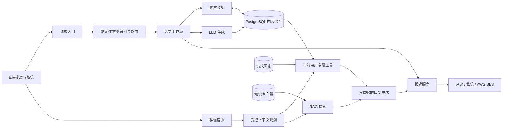

# MilkyAi

<div align="center">

**面向 B站的 AI 视频笔记邮件服务**

将公开视频转化为精炼总结、可检索文稿、中文翻译和结构化 Markdown 笔记，并直接发送到用户邮箱。

[B站主页](https://space.bilibili.com/3461574540921489) · [English](README.md) · [架构说明](docs/ARCHITECTURE.md)


<br>

[](https://space.bilibili.com/3461574540921489)

</div>

> 本仓库是 MilkyAi 的公开工程展示，不是生产源码发布。生产实现、提示词、平台集成与运行配置均保持私有；仓库中的代码只是经过有意简化的架构骨架。

## 项目概览

| 生产规模 | 产品能力 |
| --- | --- |
| **38K+** B站社区用户 | 视频总结与问答 |
| **约 300** 日活用户 | 邮件投递 Markdown 笔记 |
| **250K+** 累计请求 | 视频文稿与中文翻译 |
| **7×24** 持续运行 | RAG 增强的私信客服 |

MilkyAi 直接工作在视频所在的平台中。用户在 B站视频评论区提及 `@MilkyAi` 并选择投递渠道；系统随后完成请求分类、素材读取或提取、内容生成、可复用结果持久化，以及评论、私信或邮件投递。

MilkyAi 最具代表性的体验是 **视频转笔记邮件**：邮件正文提供便于直接阅读的 HTML 版本，同时附带可继续编辑的 Markdown 笔记和原始文稿。用户单独请求文稿时，符合条件的非中文内容还会附带中文翻译。

## 产品能力

| 能力 | 用户收到的结果 |
| --- | --- |
| 评论区总结 | 适合公开评论区阅读的精简总结 |
| 视频问答 | 基于视频可用材料生成的针对性回答 |
| 私信总结 | 更完整的私密总结，并按平台限制安全分段 |
| 邮件笔记 | HTML 正文、Markdown 笔记与文稿附件 |
| 邮件文稿 | 原文文稿，以及符合条件时附带的中文翻译 |
| 多 P 笔记 | 对符合条件的分 P 视频批量生成并发送笔记 |
| 私信客服 | 产品咨询、请求诊断、订阅查询和视频追问 |

## 系统架构



生产系统采用 **函数式编排 + 面向对象服务边界** 的混合设计：

- `main` 负责启动、依赖组装、轮询和顶层分发。
- 纵向 workflow 负责某一种用户请求的完整编排。
- 横向 service 提供素材、生成、持久化、配额、账号选择和投递等可复用能力。
- 有状态的外部集成和可替换依赖使用 class、`Protocol` 接口与构造器注入。
- 纯分类和纯数据转换逻辑继续使用函数表达。

更完整的 workflow、持久化和客服设计见 [架构说明](docs/ARCHITECTURE.md)。

## 工程亮点

### DB-first 的可复用视频资产

PostgreSQL 以 `(bvid, page)` 为身份保存视频元数据、文稿、翻译、评论总结、私信总结和 Markdown 笔记。各工作流在调用外部服务之前优先读取已有资产，减少重复 ASR 与 LLM 推理，同时为不同投递场景保留真正不同的内容产物。

### 受控的 RAG 私信客服

MilkyAi 的私信体验结合了自建产品知识库和可信的用户级工具。知识检索提供稳定的产品事实；类型明确的工具提供当前用户的订阅状态、最近请求历史和最近视频资产。确定性的上下文规划器决定本轮可使用哪些受限工具，因此模型不能虚构工具调用，也不能自行指定任意用户身份。

检索层配有 **41 个场景的回归评估集**，覆盖路由、客服边界、请求诊断、投递问题和常见对话边界情况。

### 可持久化的请求诊断

每一条被系统接收的提及都会产生持久化请求记录，包括原始请求、视频身份、实际 workflow、处理时间和投递结果。客服因此能够区分“平台没有把提及交给 Milky”、生成失败、排队、配额拒绝和投递失败，而无需从自由格式日志中猜测业务状态。

### 异步处理与可靠投递

基于 `asyncio` 的 worker pool 最多并发处理三条请求，其余任务继续排队。投递服务将私信分段、评论 fallback、频率限制和 SES 附件等渠道差异统一为结构化结果，供 workflow 持久化和诊断。

### 清晰的架构边界

代码以纵向 workflow 和共享横向 service 组织，而不是持续扩张单一 Bot 脚本。请求分类、资产访问、素材收集、LLM 生成、RAG、投递、配额和状态持久化分别拥有明确的模块责任。

## Workflow 一览

```text
评论区提及
  -> comment.summary | comment.qa
  -> dm.summary      | dm.qa
  -> email.notes     | email.transcript | email.allparts

非视频动态
  -> opus.chat

直接私信
  -> dm.customer
```

MilkyAi 当前包含 9 种用户可见的请求变体。用户指定的投递方式优先于内容格式词，例如邮件请求进入邮件 workflow，而私信请求会得到适合私信渠道的结果。

## 技术栈

- **Python 3.12** 与 `asyncio`
- **PostgreSQL**：视频资产、请求历史与 RAG 知识块
- **OpenAI-compatible LLM 与 embedding API**
- **语音识别**：为没有可用字幕的视频提供 fallback
- **AWS SES**：HTML 邮件和文件附件投递
- **Docker** 与 **Railway**：生产部署
- 结构化事件日志与七天请求诊断历史

## 公开仓库结构

```text
MilkyAi-bilibili/
├── README.md
├── README_zh_中文.md
├── docs/
│   └── ARCHITECTURE.md
├── src/milky_ai/
│   ├── domain.py          # 请求与结果的数据契约
│   ├── ports.py           # 基于接口的服务边界
│   └── workflows.py       # 编排方式示例
└── tests/
    └── test_workflows.py  # 仅测试公开架构骨架
```

这套 skeleton 用于展示架构风格，不包含生产提示词、adapter、路由规则、平台 API、凭据或运行策略，也不能直接部署为 MilkyAi 的副本。

## 查看代码骨架

公开 skeleton 不依赖第三方运行库：

```bash
python -m unittest discover -s tests
```

可以先阅读 [`src/milky_ai/ports.py`](src/milky_ai/ports.py) 了解依赖边界，再阅读 [`src/milky_ai/workflows.py`](src/milky_ai/workflows.py) 查看两条简化的编排示例。

## 源码说明

MilkyAi 是由独立开发者设计、开发并持续运营的生产服务。本仓库只展示产品能力与部分工程模式，**不是生产系统的开源发行版**。未经许可，不得依据本展示仓库复制服务、品牌或其私有实现。

欢迎访问 [MilkyAi 的 B站主页](https://space.bilibili.com/3461574540921489) 使用真实产品。
