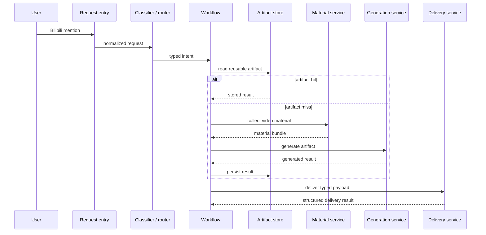
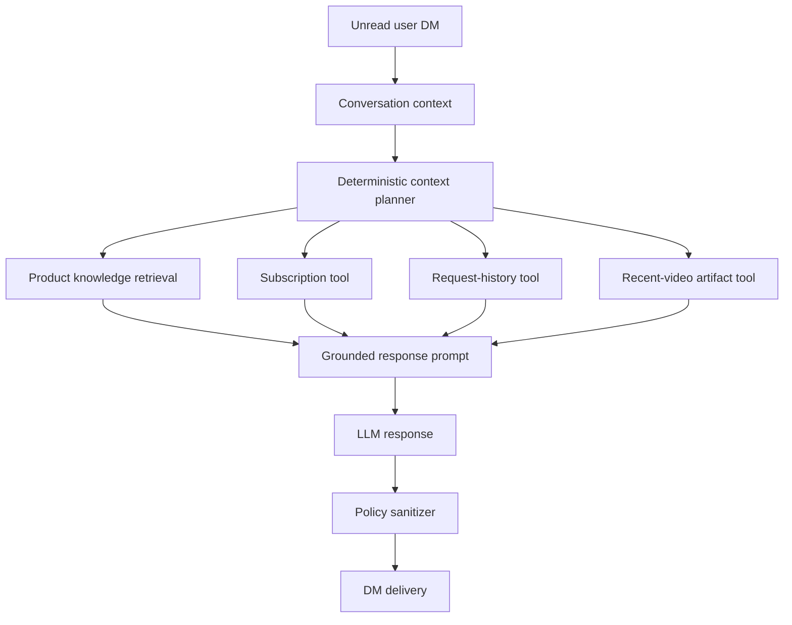

# MilkyAi Architecture

This document describes the public, implementation-independent architecture of MilkyAi. It intentionally omits production prompts, platform API details, credentials, routing expressions, database queries, and operational thresholds.

## Design Goals

MilkyAi is designed around five constraints:

1. A user request may take minutes and must not block notification polling.
2. Video extraction and model inference are expensive enough that reusable artifacts matter.
3. Bilibili comments, DMs, and email have different delivery constraints and failure semantics.
4. Customer-service answers need both stable product knowledge and accurate per-user facts.
5. A failure in persistence, translation, or an optional enrichment should not erase a usable primary result.

## Layering

```text
Entrypoint
  startup · dependency assembly · polling · dispatch

Request boundary
  event normalization · admission · intent classification · route selection

Vertical workflows
  comment · DM · email notes · email transcript · all-parts · opus · customer service

Horizontal services
  material collection · generation · artifacts · RAG · quotas · accounts · delivery

Infrastructure adapters
  Bilibili APIs · PostgreSQL · LLM/STT APIs · AWS SES · filesystem state
```

Workflows contain business sequencing, not low-level side effects. Services own reusable capabilities and return structured results. Infrastructure adapters isolate external systems behind typed interfaces.

## Request Processing



The route is deterministic. LLMs generate content; they do not decide entitlement, quotas, delivery channels, or which production workflow executes.

## Workflow Families

| Family | Variants | Responsibility |
| --- | --- | --- |
| Video comment | `comment.summary`, `comment.qa` | Public, compact delivery |
| Video DM | `dm.summary`, `dm.qa` | Private long-form delivery |
| Per-page email | `email.notes`, `email.transcript` | HTML body and attachments |
| Multi-page email | `email.allparts` | Persistent batched background job |
| Non-video post | `opus.chat` | One short comment reply |
| Customer service | `dm.customer` | RAG and current-user diagnostics |

The source material and delivery channel are separate concerns. Shared generation and material services can support several workflows, while each workflow retains control over eligibility, artifact type, delivery behavior, and quota accounting.

## Artifact Model

One PostgreSQL row represents one Bilibili video page, identified by `(bvid, page)`. The row can hold:

- video and uploader metadata;
- transcript, language, and source;
- translated transcript;
- comment summary;
- DM summary;
- Markdown notes;
- creation and request timestamps.

Comment summaries and DM summaries remain separate because their prompts, target lengths, and delivery contexts differ. Notes and transcripts are shared across workflows when their meaning is identical.

The artifact boundary follows a DB-first policy:

```text
read PostgreSQL
  -> hit: reuse the artifact
  -> miss: collect material -> generate -> best-effort persist -> deliver
```

New production writes go to PostgreSQL. Older filesystem caches are not part of the public architecture.

## Material Collection

Material collection is independent of any single delivery workflow. In broad terms it:

1. reads an existing transcript from PostgreSQL;
2. otherwise selects the best available caption track;
3. otherwise obtains an audio transcription when permitted;
4. attaches public video metadata useful for generation;
5. returns a typed material bundle.

The exact platform endpoints, download logic, ASR providers, and fallback policy are private implementation details.

## Generation Boundary

All user workflows call a shared generation layer. A generation request describes the task, input material, output constraints, and provider profile. The layer owns model invocation and structured errors; workflows own the decision to retry, fall back, persist, or deliver.

Long prompts live outside orchestration code. Distinct artifacts use distinct task profiles rather than relying on delivery-time truncation to turn one artifact into another.

## Delivery Boundary

Each channel exposes a small delivery interface and returns a structured result:

```text
DeliveryResult
  ok · channel · status · delivered_parts · failed_parts · reason
```

- Comment delivery handles public reply constraints and account selection.
- DM delivery owns message splitting, pacing, and platform refusal handling.
- Email delivery owns HTML rendering, subjects, attachments, and SES submission.

Workflows do not reproduce splitting or transport-specific error handling.

## RAG-enabled DM Customer Service

MilkyAi's customer service is intentionally a controlled agentic system rather than an unrestricted autonomous agent.



### Retrieval versus tools

RAG contains stable, public product knowledge: features, request behavior, support boundaries, and troubleshooting guidance. Live facts do not enter the vector knowledge base.

Trusted tools provide bounded, current-user-only data:

- subscription status and expiry;
- recent request records and delivery outcomes;
- recent video artifacts for follow-up questions.

The authenticated sender UID keys every tool. Neither user text nor the LLM can request another user's record.

### Conversation memory

Recent DM turns are supplied as short conversational context. Durable request history remains the source of truth for questions such as “when did I last call Milky?” or “why did I receive a summary instead of notes?” Conversation memory improves continuity but does not replace structured records.

### Evaluation

The retrieval layer has a 41-scenario regression set. Each scenario specifies acceptable source documents, expected answer concepts, and prohibited claims. Offline tests also validate deterministic context planning independently of model wording.

## Reliability and Observability

- An asynchronous worker pool bounds concurrency and preserves polling responsiveness.
- Request history records received, started, finished, and delivery timestamps separately.
- Delivery completion is distinct from workflow completion.
- Optional persistence writes are best-effort where the primary user result can still be delivered.
- Structured event names make model, artifact, and delivery transitions searchable.
- Customer service reads structured request records rather than parsing free-form logs.

## Public Skeleton

The files under `src/milky_ai/` demonstrate the dependency direction used by the production system:

- `domain.py` defines immutable request and result contracts.
- `ports.py` defines structural interfaces for external capabilities.
- `workflows.py` shows orchestration using constructor-injected dependencies.

They intentionally contain no production adapters, prompts, platform integrations, persistence queries, or routing rules.

